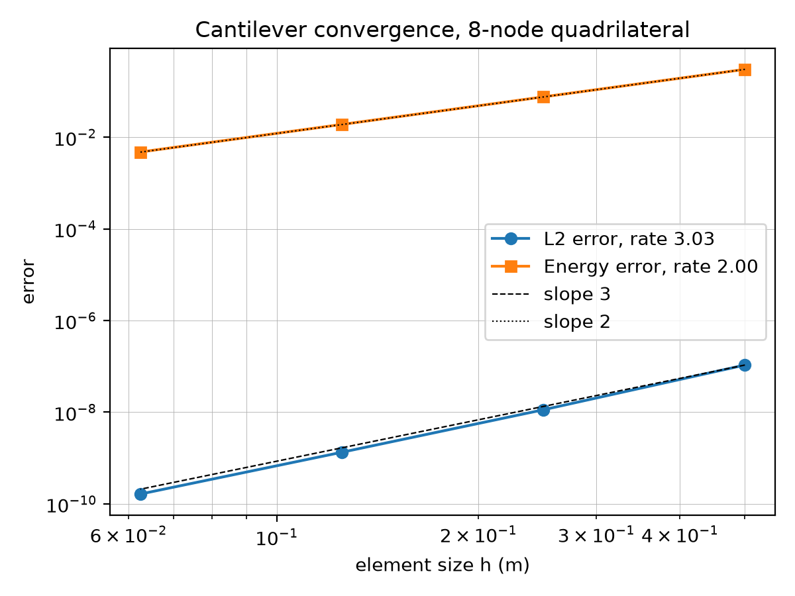
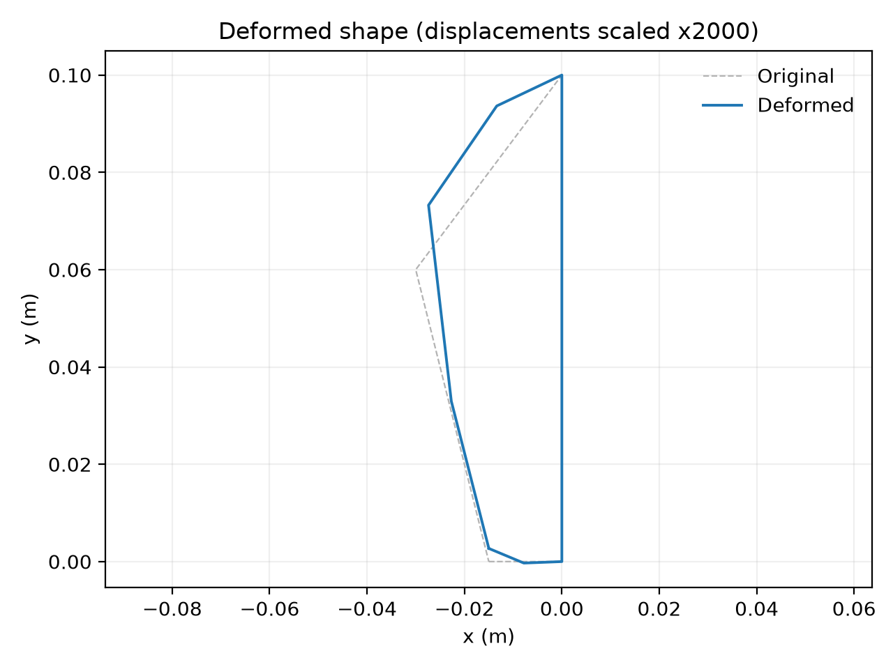
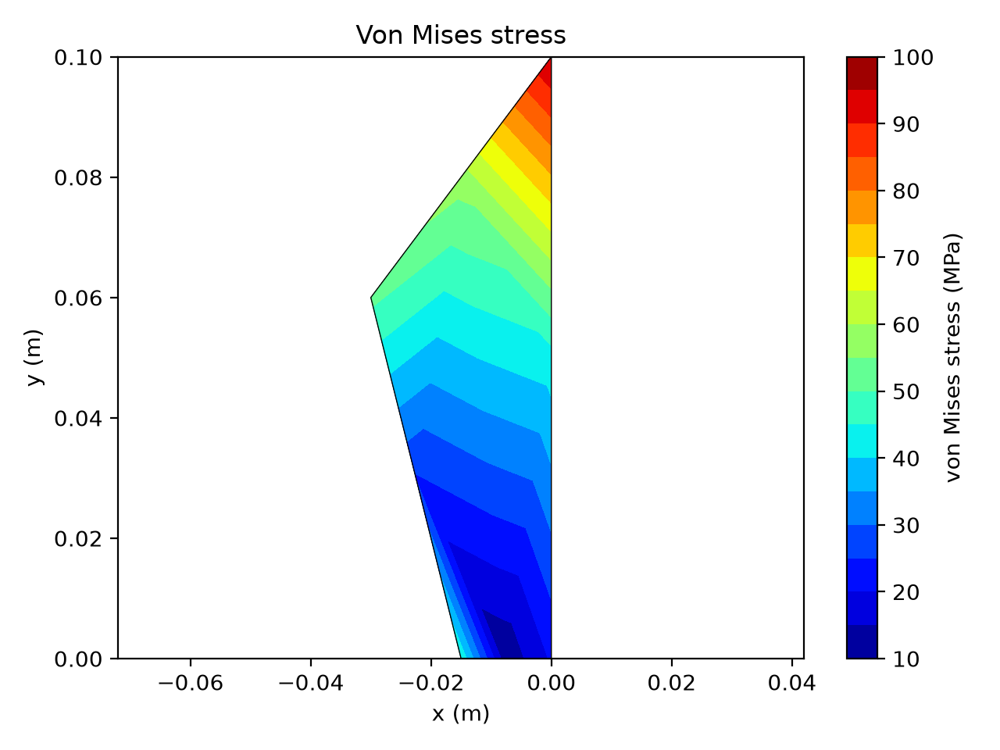

# fe-solver


`fe-solver` is a 2D plane-stress finite element package written in Python. It is built around the 8-node serendipity quadrilateral (Quad8), with the constant strain triangle (CST) included as a second element. The package covers the full chain of a linear elastic analysis: meshing, stiffness assembly, edge loads, solution, stress recovery, error norms and plotting.

The package was verified through a mesh convergence study against an exact elasticity solution. The L2 norm measures the error in displacement and the energy norm measures the error in strain. The measured convergence rates were 3.03 in the L2 norm and 2.00 in the energy norm. These match the theoretical rates of 3 and 2 for quadratic elements.

## Convergence study

An end-loaded cantilever was used as the verification problem, since it has a closed-form elasticity solution. The beam has a length of 2.0 m, a height of 0.5 m and a thickness of 0.01 m, with E = 209 GPa and ν = 0.3. A load of 1000 N is applied to the right end as a parabolic shear traction. The left end is held at the exact displacements, which are small but not zero. Thus, the finite element problem and the exact solution describe the same beam.

The exact displacement is cubic, so quadratic elements cannot reproduce it exactly. As a result, the error can be measured as the mesh is refined. The absolute errors obtained on four structured Quad8 grids are listed below, where h is the element size.

| Grid   | h (m)  | L2 error (m<sup>2</sup>) | Rate | Energy error (N<sup>0.5</sup>) | Rate |
|--------|--------|--------------------------|------|--------------------------------|------|
| 4 x 1  | 0.5000 | 1.0673e-07               |      | 3.0219e-01                     |      |
| 8 x 2  | 0.2500 | 1.1280e-08               | 3.24 | 7.5897e-02                     | 1.99 |
| 16 x 4 | 0.1250 | 1.3348e-09               | 3.08 | 1.8995e-02                     | 2.00 |
| 32 x 8 | 0.0625 | 1.6345e-10               | 3.03 | 4.7517e-03                     | 2.00 |
| Theory |        |                          | 3    |                                | 2    |

Both measured rates converge to the theoretical values. If the left end is held at zero instead of the exact values, the rates fall well below the theoretical values, because the exact solution is not zero there.



*Both error norms plotted against the element size h on log-log axes. The dashed line has a slope of 3 and the dotted line has a slope of 2.*

## Lifting lug example

The second example is a lifting lug modelled as a single Quad8 element. Three nodes are fully fixed and a vertical load of 58.86 kN is applied at one node. The peak von Mises stress is 95.61 MPa. It occurs at the upper corner of the fixed edge, which is the fixed node closest to the load. The script is self-verifying: it compares its displacements and von Mises stresses against stored reference values and prints whether they match.

| Deformed shape | Von Mises stress |
|:--------------:|:----------------:|
|  |  |
| *Drawn with a scale factor of 2000.* | *Nodal values, plotted on the undeformed shape.* |

## Usage

The example below solves the cantilever on a single 16 x 4 grid. For brevity, the left end is fixed at zero. The convergence script passes the exact displacements through `fixed_values` instead.

```python
import numpy as np
from fesolver.mesh import structured_quad8
from fesolver.elements.quad8 import Quad8
from fesolver.materials import PlaneStressMaterial
from fesolver.assembly import assembly_stiffness
from fesolver.loads import edge_traction
from fesolver.solver import solve
from fesolver.postprocess import (element_gauss_stresses, element_nodal_stresses,
                                  average_nodal_stresses, von_mises,
                                  plot_deformed_shape, plot_von_mises)

LENGTH, HEIGHT, THICKNESS, LOAD = 2.0, 0.5, 0.01, 1000.0   # m, m, m, N
I = THICKNESS * HEIGHT**3 / 12
steel = PlaneStressMaterial(209e9, 0.3)


def end_traction(x, y):
    """Traction (tx, ty) in pascals on the right end: a parabolic shear."""
    yc = y - HEIGHT / 2
    return (0.0, LOAD / (2 * I) * (HEIGHT**2 / 4 - yc**2))


mesh = structured_quad8(LENGTH, HEIGHT, 16, 4)
K = assembly_stiffness(mesh, Quad8, steel, THICKNESS)

# Load: one (end, middle, end) triplet per element edge on the right end
F = np.zeros(mesh.n_dofs)
for e in range(mesh.n_elements):
    row = mesh.connectivity[e]
    edge_nodes = [row[1], row[5], row[2]]
    if np.allclose(mesh.nodes[edge_nodes][:, 0], LENGTH):
        F += edge_traction(mesh, edge_nodes, end_traction, THICKNESS)

# Supports: every node on the left end; node i owns DOFs 2i and 2i + 1
fixed_dofs = []
for node, (x, y) in enumerate(mesh.nodes):
    if np.isclose(x, 0.0):
        fixed_dofs += [2 * node, 2 * node + 1]

u = solve(K, F, fixed_dofs)

# Stress recovery: Gauss points, then element nodes, then nodal averages
strain, stress = element_gauss_stresses(mesh, u, Quad8, steel)
nodal = element_nodal_stresses(mesh, stress, Quad8)
vm = von_mises(average_nodal_stresses(mesh, nodal))

plot_deformed_shape(mesh, u, 1000, Quad8)
plot_von_mises(mesh, vm, Quad8)
```

SI units (m, N, Pa) are used throughout the package. The DOF order is `[u1, v1, u2, v2, ...]`.

## Installation and tests

Python 3.10 or later is required. The package was developed on Python 3.12.

```bash
git clone https://github.com/yasinghazaly/fe-solver.git
cd fe-solver
pip install -e .
pip install pytest
```

The test suite contains 61 tests and is run from the repository root:

```bash
pytest
```

Among other checks, the suite confirms that each stiffness matrix has exactly three rigid-body modes.

The two examples are also run from the repository root:

```bash
python examples/cantilever_convergence.py
python examples/lifting_lug.py
```

## Folder layout

```
fe-solver/
├── pyproject.toml
├── README.md
├── docs/
│   ├── images/          figures used in this README
│   └── theory.md        derivation of the method
├── examples/
│   ├── cantilever_convergence.py   h-refinement study against the exact solution
│   └── lifting_lug.py              single Quad8 lug, self-verifying
├── fesolver/
│   ├── materials.py     PlaneStressMaterial
│   ├── quadrature.py    Gauss rules in 1D and 2D
│   ├── mesh.py          Mesh class and structured_quad8
│   ├── assembly.py      global stiffness assembly
│   ├── solver.py        solution with prescribed displacements
│   ├── loads.py         consistent edge tractions
│   ├── errors.py        L2 and energy error norms
│   ├── postprocess.py   stress recovery, von Mises and plots
│   └── elements/
│       ├── base.py      abstract element base class
│       ├── quad8.py     8-node serendipity quadrilateral
│       └── cst.py       constant strain triangle
└── tests/               61 tests
```

Library code is kept in `fesolver/`, whereas problem-specific scripts are kept in `examples/`.

## Theory

The Quad8 is an isoparametric element, where the geometry and the displacement are described using the same set of quadratic shape functions. The element stiffness matrix is evaluated through Gauss numerical integration with a 3 x 3 rule. Boundary conditions are applied by partitioning the global system, which allows non-zero displacements to be prescribed. Stresses are computed at the Gauss points, extrapolated to the element nodes with a least-squares fit, and then averaged at the nodes shared between elements. The error norms are integrated with a higher-order rule than the element itself. For quadratic elements, the L2 error is expected to fall as h<sup>3</sup> and the energy error as h<sup>2</sup>.

The full derivation is given in [docs/theory.md](docs/theory.md).

## Limitations

- The analysis is 2D plane stress only: linear elastic, isotropic and small strain.
- Only the Quad8 and CST elements are available, with one element type per mesh.
- The stiffness matrix is dense and the system is solved directly.
- The mesh generator covers structured rectangular Quad8 grids only. There is no mesh import.
- Edge tractions are implemented for Quad8 edges only.
- Point loads are applied by writing directly into the force vector.
- Body forces and thermal loads are not included.
- Convergence was verified for the Quad8 only.

## Author

Yasin Ghazaly